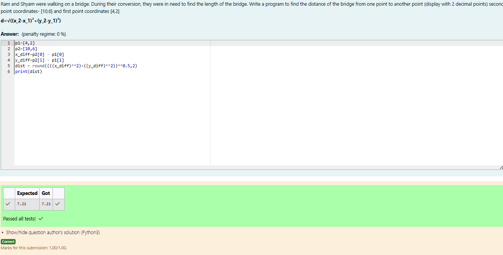

# DISTANCE-BETWEEN-TWO-POINTS

## AIM:
To write a python program to find the distance two 2 points
## ALGORITHM:
### Step 1: 
### Step 2: 
### Step 3: 
Substitute the values in the distance formula  formula.JPG

### Step 4: 
### Step 5: 
### PROGRAM:
## Developed by: V.Divyashree
## Register No: 212223230051
```
p1=[4,2]
p2=[10,6]
x_diff=p2[0] - p1[0]
y_diff=p2[1] - p1[1]
dist = round((((x_diff)**2)+((y_diff)**2))**0.5,2)
print(dist)
```
### OUTPUT:

### RESULT:
Thus the program is executed and the output is achieved.